# Project 1

## Flower Online Store
A international flower delivery store that sells different bouquets for the special someone.

[View Live Project Here](https://mallenur.github.io/Project1FlowerOnlineStore/)

# User Experience (UX)
## User stories

Goals for a first time user:

- I want the user to have a good idea of what the website is about from the homepage.
- I want easy navigation throughout the website.
- I want to be able to obtain further information about the website and its purpose.
- I want the user to read more about the flower store and be interested in buying a bouquet.
- I want the user to be interested in being a long time customer and subscribe or follow the websites social accounts.
- I want the user to be able to contact the owner or the support through contact page.

# Design

## Color Scheme 
  -  rgb(184,102,102)
  -  White #fff
  -  Black #000
  -  Rgb(143, 79, 79)
  -  Rgb(254, 220, 220)
  -  Rgb(55, 55, 55)
  -  Rgb(141, 141, 141)
  -  Rgb(207, 207, 207)
  -  Rgb(255, 250, 250)

## Typography

  - Raleway
  - Sans-serif
  
The main font used for the website is Raleway with sans-serif as the fallback. 
To keep things simple and clean, Raleway is the only font used throuhout the website, but with diffrent font weight.
This fonts is both modern, readble and suits the project overall.
 

# Wireframes

- The wireframes were created using [Balsamiq](https://balsamiq.cloud/). And they were designed for mobile, tablets and desktop.

## Wireframe Website/Mobile Homepage

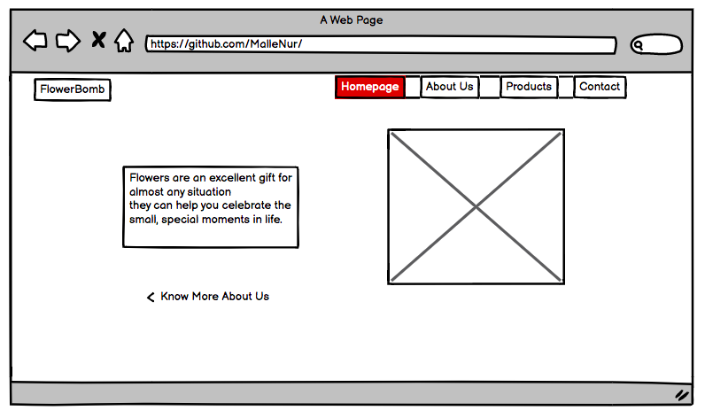
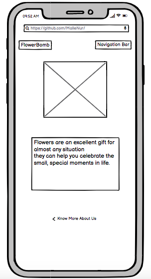

## Wireframe Website/Mobile About Us

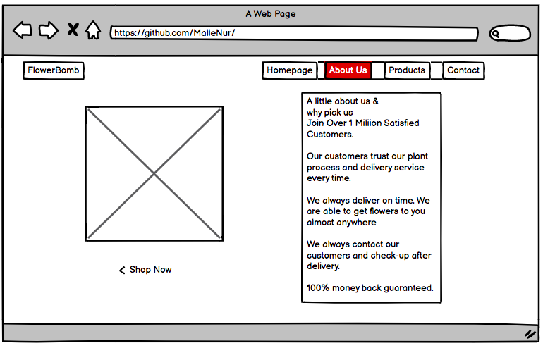
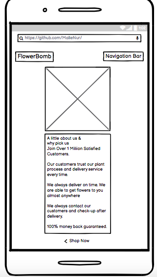

## Wireframe Website/Mobile Products

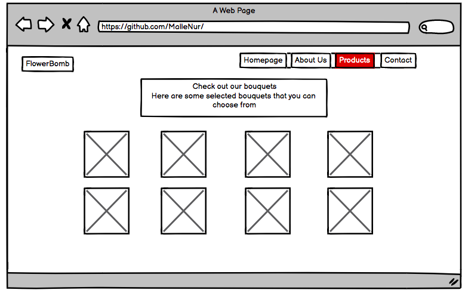
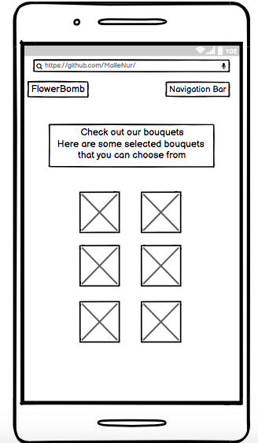

## Wireframe Website/Mobile Contact Us

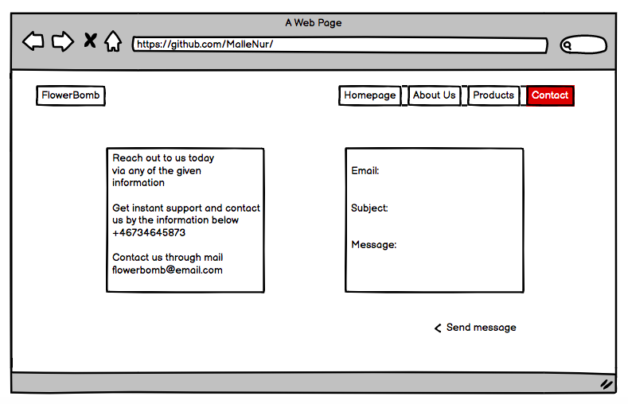
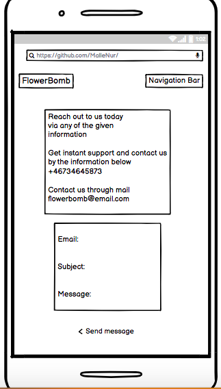

# Features

## Homepage

A simple homepage with clear navigation bar where the user can choose which page they want to press.
The homepage have an image that represents the website and a header that describes the intention of the websites.

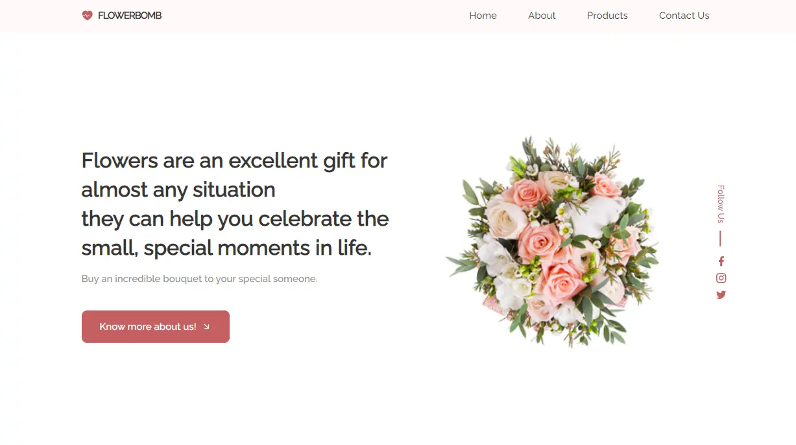

## About Us

The about page gives the user information about the company and what the company can offer to future customers. 

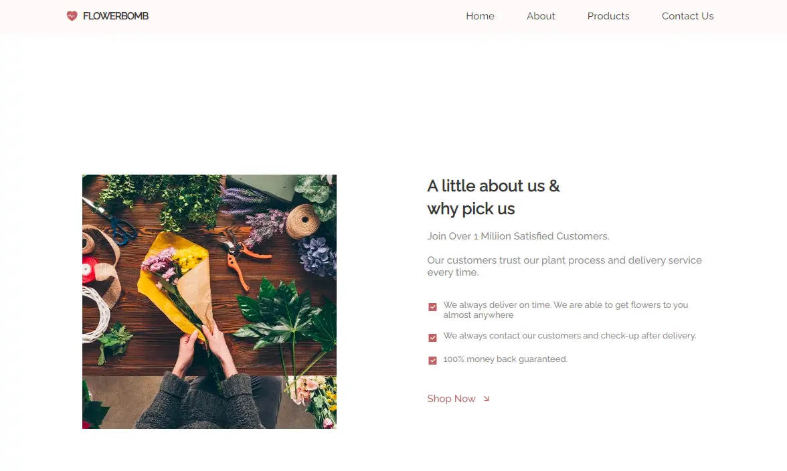

## Products
This page shows all the products that the company offers. The user will see different bouquets that they can choose from. 

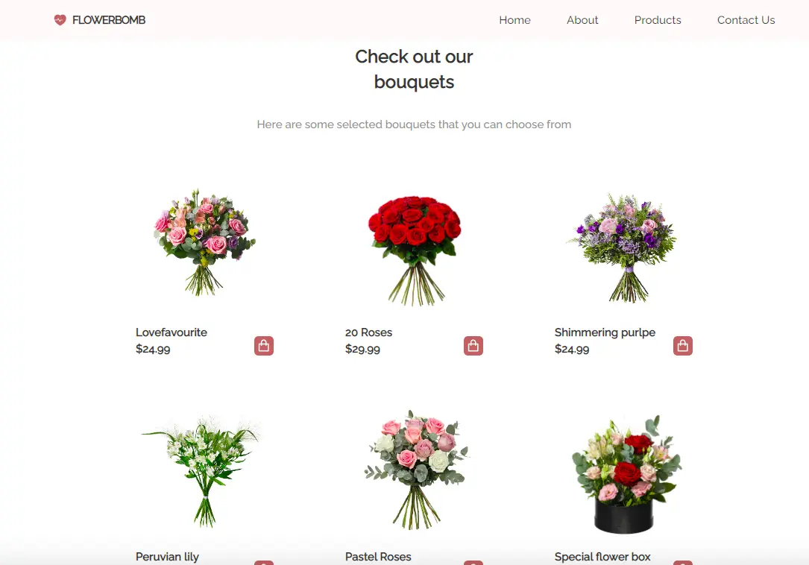
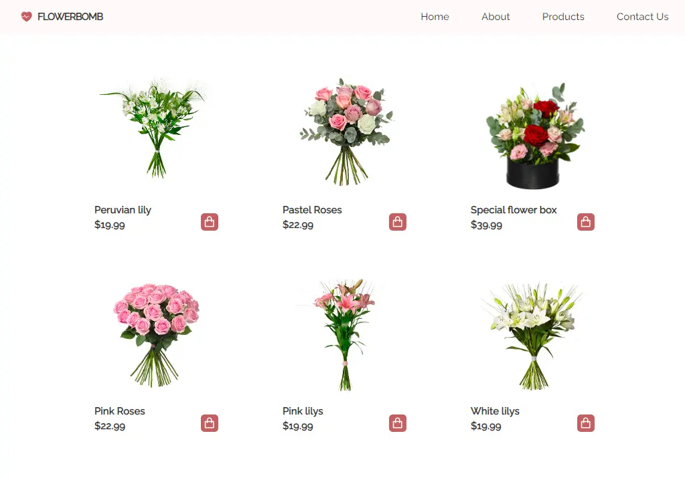

## Contact Us

The contact page has contact information that the user can use too get a hold on support or company owner. 

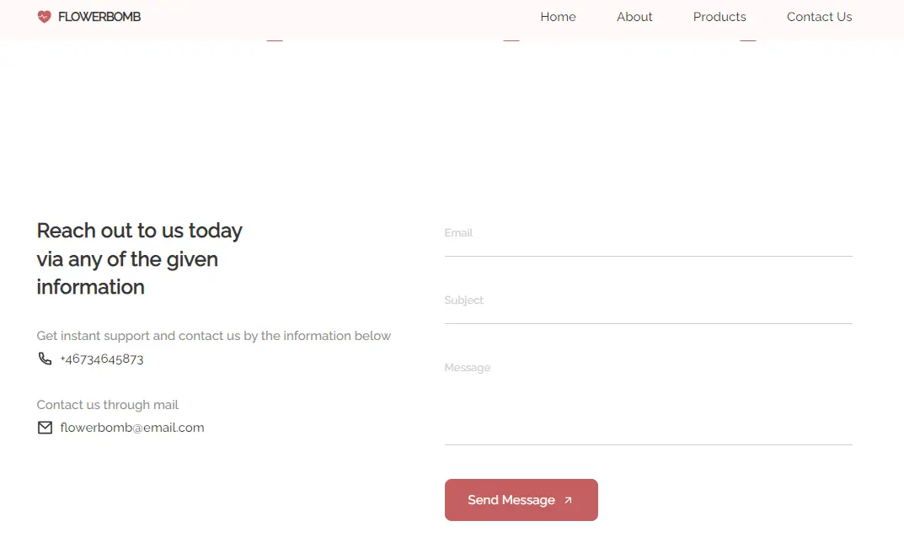

## Footer

The footer has a short information about the company and what type of paying methods the company offers and allows. 
The user can also choose to subscribe by sending their email to get company offers. 

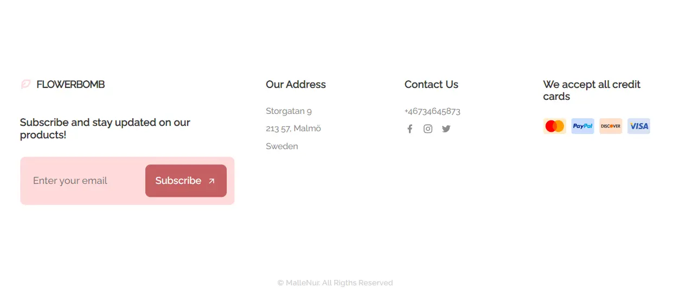

# Technology Stack

## Languages Used

- HTML
- CSS
- Javascript

## Frameworks, Libraries and Programs Used

- [Font Awesome](https://fontawesome.com/)
- [Remicon](https://remixicon.com/)
- [Github](https://github.com/)
- [Gitpod](https://www.gitpod.io/)
- [Google Fonts](https://fonts.google.com/)

# Validator Testing

W3C Markup Validator was used to check the markup validity of the HTML for technical quality and correctness, and no errors found.
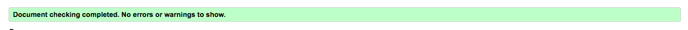

W3C CSS Validation Service was used to check the markup validity of the CSS for technical quality and correctness, and no errors found.
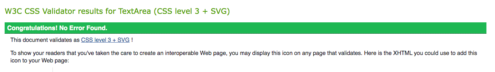

Chromes Lighthouse

# Deployment
## Project Setup:

- Create new repository in Github
- Select Code Institute Full Template
- Name and create the repository
- On the repository page, CLICK the green GITPOD button to launch GITPOD
- Commands used for version control during the project;
 * git add "file name" to add files to stage
 * git commit -m "commit message"
 * git push to push changes through to main in Github

## The website was deployed to Github Pages with the following steps:

- Click on the settings icon at the top of the page in the navigation bar.
- Scroll down untill you see Github Pages.
- There will be a message box saying "Check it out here" Click on the link to take you to the next page.
- Here you will be greated with a form, Choose the repository Quiz-Project2
- Choose the branch in the drop down box, in this case MAIN
- Choose the directory in the next dropp down box, in this case Root.
- Then click Save

It may take a few moments for the site to publish, but once live, the box at the top of the page with the site name will turn green and have a Green tick to the left of the link to the live site.

[View Live Project Here](https://mallenur.github.io/Project1FlowerOnlineStore/)

# Acknowledgement
I have thank my Code Institute mentor Narender who have helped along the way and given me guidance and support in my projects.

I have also taken inspiration and lessons from some youtube channels that gave me a couple of informtion about how to code in HTML and CSS.

Here is a couple of them:

https://www.youtube.com/watch?v=D-h8L5hgW-w

https://www.youtube.com/watch?v=oYRda7UtuhA

https://www.youtube.com/watch?v=ZdJSHEczi_0
